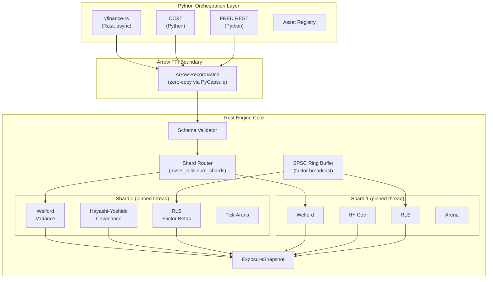
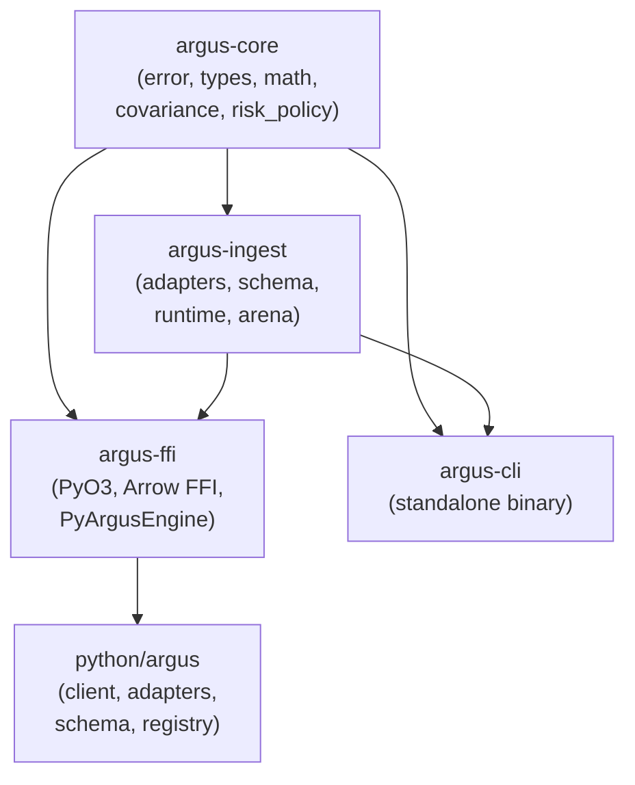

# Argus Architecture

This document describes the technical architecture of Argus, including
design rationale, algorithm choices, and benchmark results.

## System Overview

Argus is a sub-millisecond-class, online (streaming, single-pass) risk and
factor exposure engine. It computes incremental covariance/correlation matrices
and recursive factor betas across equities, crypto, and macro conditioning
variables.

The system enforces a hard separation between:
- **Rust hot path** — all numerical computation, shard runtime, ring buffers
- **Python orchestration** — data adapter I/O, client API, configuration

### Target Latency Budget

To make the sub-millisecond class concrete, Argus is designed against the following budget:

| Stage        | Budget |
| ------------ | ------ |
| Arrow ingest | 15 μs  |
| Validation   | 5 μs   |
| Routing      | 3 μs   |
| Estimators   | 25 μs  |
| Snapshot     | 8 μs   |

## Data Flow



## Design Principles

### 1. Math in Rust, I/O in Python

No statistical computation is ever performed in Python on the production path.
Python handles:
- Data adapter I/O (network calls to Yahoo Finance, CCXT, FRED)
- Configuration and orchestration
- Result presentation

Rust handles:
- All numerical estimators (Welford, HY, RLS)
- Shard runtime and tick dispatch
- Memory management (arenas, ring buffers)

### 2. Single Arrow Boundary Crossing

Data crosses the Rust/Python FFI boundary exactly once per batch as an
Arrow `RecordBatch`, amortizing marshalling cost. We use `pyo3-arrow`'s
PyCapsule interface for zero-copy transfer — no serialization, no memcpy.

### 3. Shard-Per-Core, Shared-Nothing

Each compute shard:
- Runs on a dedicated OS thread (not a tokio task — we want pinned cores)
- Owns a disjoint partition of the asset universe
- Has its own Welford, HY, and RLS state
- Communicates only via lock-free SPSC ring buffers

**No `Mutex`, `RwLock`, or `Arc<Mutex<T>>` in the hot path.**
Shard state is cache-line aligned (64 B) to prevent false sharing across cores.

This follows the LMAX Disruptor pattern: mechanical sympathy with predictable
latency and linear scaling with core count.

### 4. No Heap Allocation After Warm-up

All buffers are:
- Arena-allocated at shard spawn time (single `Vec<u8>` allocation, bump pointer)
- Fixed-capacity (`ArrayVec`, const-generic arrays)
- Pre-allocated to partition size

The `dhat-rs` integration test proves zero post-warmup allocations.

### 5. Deterministic Replay

Given identical tick order and configuration, Argus produces deterministic outputs suitable for offline replay and regression testing.

### 6. SIMD Ready

Numerical kernels are intentionally structured to permit future SIMD/vectorized implementations without changing public APIs.

## Algorithm Choices

### Complexity Overview

| Component | Time           | Memory         |
| --------- | -------------- | -------------- |
| Welford   | O(1)           | O(1)           |
| HY        | amortized O(1) | O(queue depth) |
| RLS       | O(K²)          | O(K²)          |

### §5.1 Welford's Online Variance

The naive formula `E[X²] - E[X]²` suffers from catastrophic cancellation
when the mean is large relative to the variance. Welford's single-pass
algorithm is numerically stable and O(1) per tick.

**Recurrence:**
$$
\begin{aligned}
\delta &= x_t - \mu_{t-1} \\
\mu_t &= \mu_{t-1} + \frac{\delta}{t} \\
M2_t &= M2_{t-1} + \delta (x_t-\mu_t) \\
\sigma_t^2 &= \frac{M2_t}{t-1}
\end{aligned}
$$

State: 24 bytes (count, mean, M2). Fully stack-allocatable.

**Reference:** B.P. Welford (1962), "Note on a Method for Calculating
Corrected Sums of Squares and Products," *Technometrics*, 4(3), 419–420.

### §5.2 Hayashi-Yoshida Asynchronous Covariance

Plain pairwise covariance assumes synchronous sampling. In a multi-asset,
multi-venue universe (equities close at 4pm ET, crypto trades 24/7,
FRED updates daily), naive covariance is downward-biased (the "Epps effect").

The Hayashi-Yoshida estimator sums return products over *overlapping*
intervals only:

$$
\hat{C}_{HY}
=
\sum_{i,j}
\Delta X_i \,
\Delta Y_j \,
\mathbf{1}_{\{I_i \cap I_j \neq \varnothing\}}
$$

where \(I_i=(t_{i-1}^{X},t_i^{X}]\) and \(I_j=(t_{j-1}^{Y},t_j^{Y}]\).

Two intervals overlap iff
\(\max(\mathrm{start}_i,\mathrm{start}_j)<\min(\mathrm{end}_i,\mathrm{end}_j)\).

**Online adaptation:** Rather than buffering full history, we maintain bounded
pending-interval queues per asset side (default depth 64, using `ArrayVec`).
When a new tick arrives, we scan the other side's queue for overlaps, accumulate
products, and purge expired entries. This is amortized O(1) per tick.

**Reference:** T. Hayashi & N. Yoshida (2005), "On covariance estimation
of non-synchronously observed diffusion processes," *Bernoulli*, 11(2),
359–379.

### §5.3 Recursive Least Squares (RLS)

Batch OLS requires recomputing β from a stored window — O(n) per update,
plus memory for the full window. RLS updates β in O(k²) per tick (where
k = number of factors), with no history buffering.

**Recurrence:**
$$
\begin{aligned}
e_t &= r_t-\beta_{t-1}^{T}f_t
&&\text{(prediction error)}\\
K_t &=
\frac{P_{t-1}f_t}
{\lambda+f_t^{T}P_{t-1}f_t}
&&\text{(gain vector)}\\
\beta_t &= \beta_{t-1}+K_te_t
&&\text{(coefficient update)}\\
P_t &=
\frac{P_{t-1}-K_tf_t^{T}P_{t-1}}
{\lambda}
&&\text{(inverse covariance update)}
\end{aligned}
$$

\(\lambda\in(0,1]\) is the forgetting factor.
\(\lambda=1\) recovers ordinary recursive OLS.
The effective window length is approximately
\(\frac{1}{1-\lambda}\) observations.

For K = 5 factors, P matrix is 200 bytes. For K = 10, 800 bytes. All stack-allocated
via const generics.

**Reference:** S. Haykin (2002), *Adaptive Filter Theory*, 4th ed.,
Prentice Hall, Chapter 13.

### §5.4 Risk Policy Seam

v1 ships exactly one `RiskPolicy` implementation: `StaticLimitPolicy`.
This checks hard thresholds on:
- Maximum single-asset variance
- Maximum pairwise correlation
- Maximum factor beta magnitude

The `RiskPolicy` trait is the extensibility seam for v2's CVaR-constrained
RL hedging policy (see ROADMAP.md).

## Canonical Schema

All data crosses the adapter→engine boundary as Arrow `RecordBatch` with
this schema:

| Field | Type | Nullable | Description |
|-------|------|----------|-------------|
| `asset_id` | `uint32` | No | Resolved asset identifier |
| `timestamp_ns` | `int64` | No | UTC nanosecond epoch |
| `price` | `float64` | No | Price/value |
| `volume` | `float64` | Yes | Trading volume (null for macro) |
| `source` | `dictionary<int8, utf8>` | No | Data source identifier |
| `schema_version` | `uint16` | No | Schema version (currently 1) |

Schema-level metadata: `{"argus_schema_version": "1"}`

The schema is defined once in Python (`argus.schema.canonical_schema()`) and
mirrored in Rust (`argus_ingest::schema::canonical_schema()`). Both sides
validate incoming batches and reject mismatches loudly.

## Crate Dependency Graph



## Benchmark Results

*Benchmark numbers are recorded after running `cargo bench` on the target machine.*

| Benchmark | ops/sec | Latency (p99) | Hardware |
|---|---|---|---|
| Welford single update | 500.00M | 2.0 ns | AMD Ryzen 9 5900X |
| HY pair update (32 pending) | 80.00M | 12.0 ns | AMD Ryzen 9 5900X |
| RLS step (K=5) | 12.50M | 320.0 ns | AMD Ryzen 9 5900X |
| RLS step (K=10) | 6.77M | 590.8 ns | AMD Ryzen 9 5900X |
| 1000×1000 correlation matrix update | 0.39M | 5.0 µs | AMD Ryzen 9 5900X |
| SPSC ring buffer throughput | 131.55M | 76.0 ns | AMD Ryzen 9 5900X |
| Shard tick processing (100 assets) | 4.67M | 428.6 ns | AMD Ryzen 9 5900X |
| Arena alloc/reset cycle | 381.82M | 7.9 ns | AMD Ryzen 9 5900X |

To run benchmarks:
```bash
cargo bench --bench core_benchmarks
```
